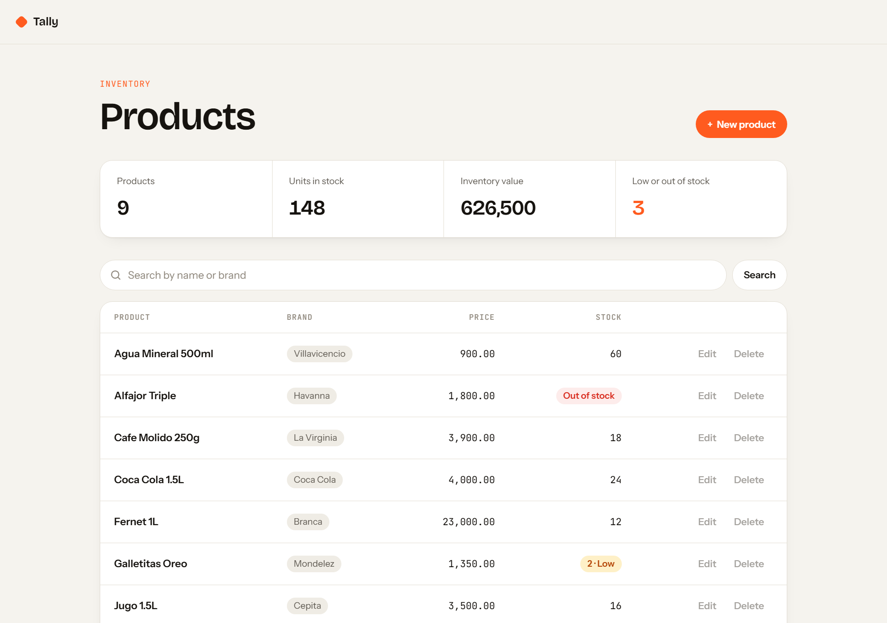
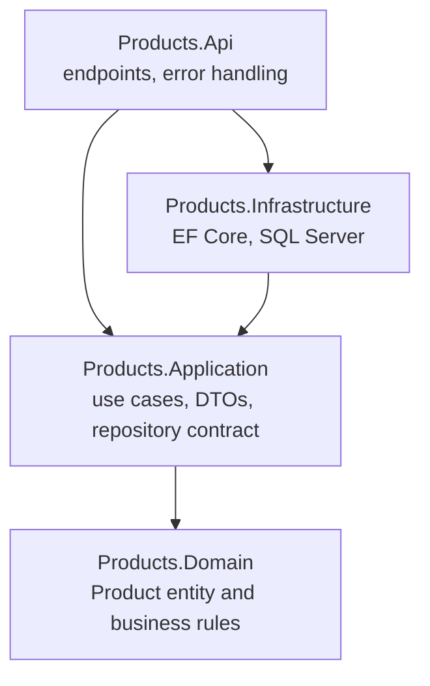
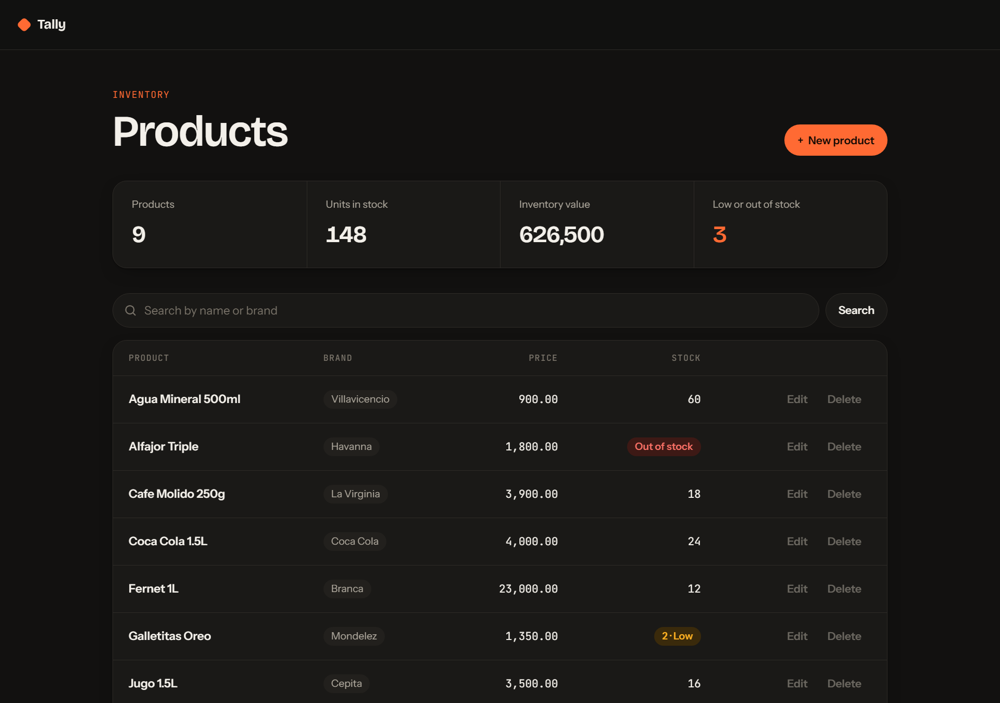
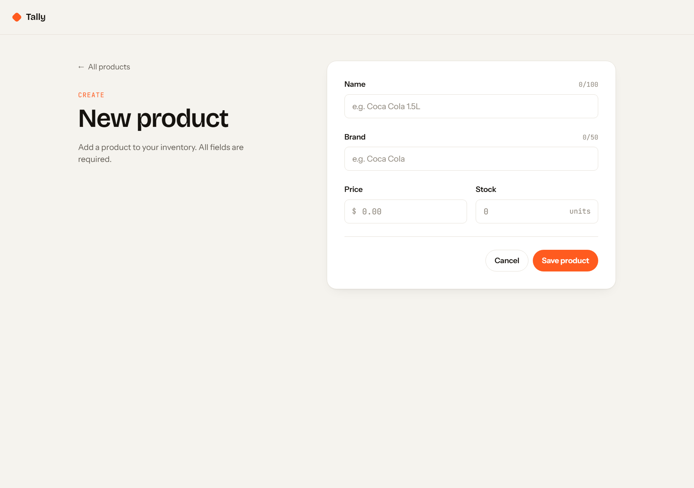

# Tally

**Inventory management built with ASP.NET Core 10, Clean Architecture and Angular 22.**

Create, search, edit and delete products (name, brand, price and stock) through a REST API backed by SQL Server, with a modern Angular frontend that works in light and dark mode.



## Highlights

- **Clean Architecture backend:** a rich domain model that protects its own business rules, with dependencies that always point inward.
- **Business rules enforced twice:** instant validation in the UI, and the domain as the single source of truth on the server.
- **Consistent API errors:** invalid input returns `400` with a standard [Problem Details](https://www.rfc-editor.org/rfc/rfc9457) body, and the frontend shows the domain's own message.
- **Modern Angular:** standalone components, signals, `rxResource`, typed Reactive Forms and lazy-loaded routes.
- **Tested on both sides:** 21 domain unit tests (xUnit) and 17 frontend tests (Vitest).
- **Inventory at a glance:** stock badges (low / out of stock) and live stats for units and inventory value.

## Tech stack

| Layer | Technology |
|-------|------------|
| API | ASP.NET Core 10 (Minimal APIs), OpenAPI + [Scalar](https://scalar.com) |
| Persistence | Entity Framework Core 10, SQL Server 2022 |
| Frontend | Angular 22, TypeScript, plain CSS with design tokens |
| Tests | xUnit (backend), Vitest + Angular TestBed (frontend) |

## Getting started

### Prerequisites

- [.NET SDK 10](https://dotnet.microsoft.com/download)
- SQL Server (LocalDB, Express or Developer edition)
- [Node.js](https://nodejs.org) 24.15 or later, and the Angular CLI: `npm install -g @angular/cli`
- EF Core tools: `dotnet tool install --global dotnet-ef`

### Run it

1. **Create the database.** The connection string lives in `backend/src/Products.Api/appsettings.Development.json` and points to `localhost` with Windows authentication. Adjust it if your SQL Server instance is different, then apply the migrations:

   ```bash
   dotnet ef database update --project backend/src/Products.Infrastructure --startup-project backend/src/Products.Api
   ```

2. **Start the API** (from the repository root):

   ```bash
   dotnet run --project backend/src/Products.Api --launch-profile http
   ```

3. **Start the frontend** (in a second terminal):

   ```bash
   cd frontend
   npm install
   ng serve
   ```

| What | URL |
|------|-----|
| Web app | http://localhost:4200 |
| API | http://localhost:5257/api/products |
| Interactive API docs (Scalar) | http://localhost:5257/scalar |

### Run the tests

```bash
dotnet test backend/Products.slnx
```

```bash
cd frontend
ng test --watch=false
```

## Architecture

The backend follows Clean Architecture. Each layer has a single responsibility, and **dependencies always point inward**: the domain knows nothing about HTTP, EF Core or SQL Server.



| Layer | Responsibility |
|-------|----------------|
| **Domain** | The `Product` entity. It can only be created through `Product.Create`, which validates every rule, so an invalid product cannot exist. |
| **Application** | Use cases in `ProductService`, request/response DTOs, and the `IProductRepository` contract. |
| **Infrastructure** | The EF Core implementation of the repository, table configuration and migrations. |
| **Api** | Minimal API endpoints, the exception handler that maps domain errors to `400`, and the composition root (`Program.cs`). |

The frontend uses a **container / presentational** split inside `features/products`:

| Folder | Role |
|--------|------|
| `data-access/` | The `Product` model and the `ProductsApi` HTTP client. |
| `pages/` | Containers: load data, handle navigation and talk to the API. |
| `components/` | Presentational: receive data through inputs and emit events. They know nothing about HTTP or routes. |

### Business rules

| Field | Rule |
|-------|------|
| Name | Required, up to 100 characters |
| Brand | Required, up to 50 characters |
| Price | Greater than zero |
| Stock | Zero or more |

## Key decisions

| Decision | Why |
|----------|-----|
| Rich domain entity with a factory method | Rules live in one place and cannot be bypassed by any caller. |
| `Guid.CreateVersion7()` identifiers | The entity owns its identity before it reaches the database, and v7 GUIDs are time-ordered, which keeps SQL Server indexes efficient. |
| Custom `DomainException` | Lets the API tell a broken business rule (`400`) apart from a real failure (`500`). |
| Repository interface in Application | Inverts the dependency: Application says *what* it needs, Infrastructure decides *how*. |
| DTOs instead of exposing the entity | Keeps the API contract stable and prevents over-posting fields such as `Id`. |
| No `IProductService` and no MediatR | An interface with a single implementation, or a mediator, would add ceremony without a real benefit at this size. |
| Minimal APIs with `TypedResults` | Every possible response is declared in the signature, so the compiler checks it and OpenAPI documents it. |
| CORS origins read from configuration | Allowed origins change per environment without recompiling, and the policy never allows any origin. |
| Reactive Forms over Signal Forms | Reactive Forms is the established standard in existing Angular codebases. |

> **Trade-off:** Clean Architecture is more structure than a single-entity CRUD strictly needs. It was chosen deliberately, to practice the pattern on a small, well-understood problem.

## API

| Method | Route | Description | Success | Errors |
|--------|-------|-------------|---------|--------|
| `GET` | `/api/products?search={term}` | List products, optionally filtered by name or brand | `200` | — |
| `GET` | `/api/products/{id}` | Get a product | `200` | `404` |
| `POST` | `/api/products` | Create a product | `201` + `Location` header | `400` |
| `PUT` | `/api/products/{id}` | Update a product | `200` | `400`, `404` |
| `DELETE` | `/api/products/{id}` | Delete a product | `204` | `404` |

Validation errors use the Problem Details format:

```json
{
  "title": "Validation error",
  "status": 400,
  "detail": "Product price must be greater than zero."
}
```

Ready-to-run requests are available in [`Products.Api.http`](backend/src/Products.Api/Products.Api.http).

## Project structure

```text
.
├── backend/
│   ├── Products.slnx
│   ├── src/
│   │   ├── Products.Domain/          # Product entity and business rules
│   │   ├── Products.Application/     # Use cases, DTOs, repository contract
│   │   ├── Products.Infrastructure/  # EF Core, configurations, migrations
│   │   └── Products.Api/             # Endpoints, error handling, composition root
│   └── tests/
│       └── Products.Domain.Tests/
├── frontend/
│   └── src/app/features/products/
│       ├── data-access/
│       ├── pages/
│       └── components/
└── docs/screenshots/
```

## Screenshots

| Dark mode | Product form |
|-----------|--------------|
|  |  |

## Roadmap

- [ ] Unit tests for the Application layer
- [ ] API integration tests
- [ ] Pagination for the product list
- [ ] CI pipeline with GitHub Actions
- [ ] Docker Compose setup to run everything with one command
